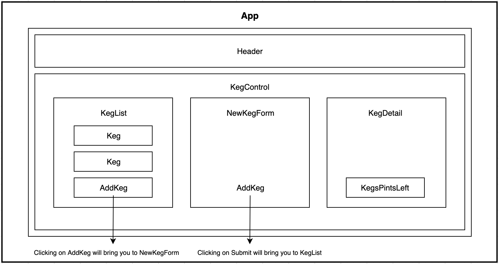

# _Kombucha Tracker_

#### _A virtual museum using Cooper Hewitt's "Get Random" API, 8/2/20_

#### By _**Hannah Beinstein**_

## Description
Kombucha Tracker is a web app to track kombucha keg inventory and update Kombucha amounts as customers purchase pints. 

## Setup/Installation Requirements

Software Requirements
1. Internet browser
2. A code editor like VSCode or Atom to view or edit the codebase.
3. A free CooperHewitt.org account and API key

## App Wireframe

## Known Bugs

_Hoping to add a loader in the future to minimize white background "flashing" between API calls._
_Planning to constrain imgs displayed by size to prevent distortion of certain imgs that don't fit frame proportions_

## Support and contact details

_Please contact me through my Github or at hannah.beinstein@gmail.com._

## Technologies Used

* _HTML_
* _CSS_
* _JavaScript_
* _jQuery_
* _Webpack_
* _Babel_

### License

MIT License.

Copyright (c) 2020 **_Hannah Beinstein_**